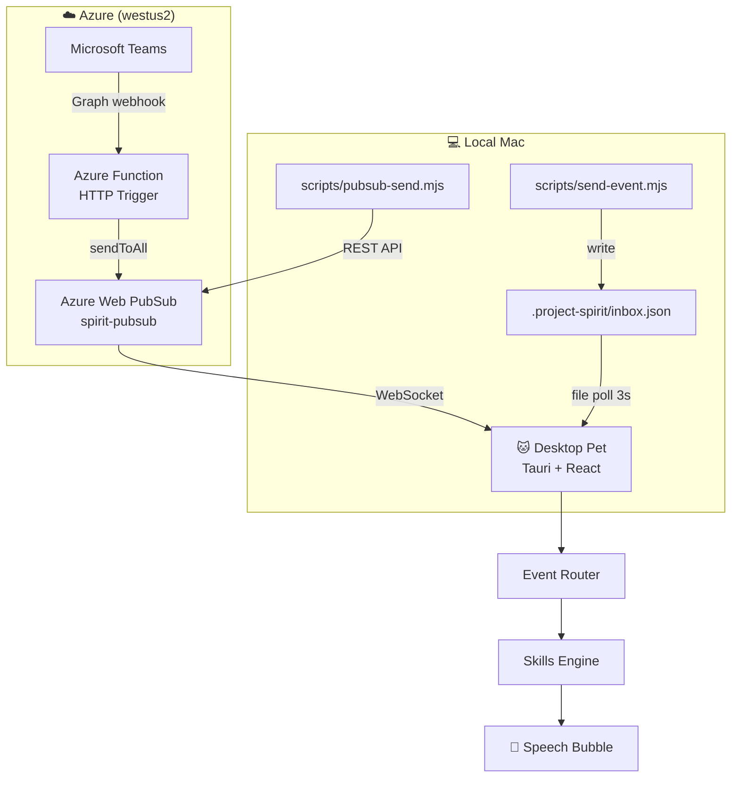

# Abby AI Companion — Desktop Pet

## Architecture



## Azure Resources Created

| Resource        | Type             | SKU     | Resource Group      | Location |
| --------------- | ---------------- | ------- | ------------------- | -------- |
| `spirit-pubsub` | Azure Web PubSub | Free_F1 | `rg-project-spirit` | westus2  |

**Subscription:** Azure Container Service - Test (`8ecadfc9-...`)

Connection string stored in `.envrc` (gitignored):

```bash
export PUBSUB_CONNECTION_STRING="Endpoint=https://spirit-pubsub.webpubsub.azure.com;AccessKey=...;Version=1.0;"
```

## Quick Start

```bash
npm install
npm run tauri dev     # launch desktop pet (file inbox only)
```

With WebSocket (real-time):

```bash
# Generate client URL and launch with it
VITE_PUBSUB_URL=$(node scripts/negotiate.mjs) npm run tauri dev
```

## Event Delivery

| Method                 | Latency | Use case                                            |
| ---------------------- | ------- | --------------------------------------------------- |
| WebSocket (Web PubSub) | Instant | Production: Azure Function → PubSub → pet           |
| File inbox (poll)      | ≤3s     | Dev fallback: write to `.project-spirit/inbox.json` |

### Send test events

```bash
# Via file inbox (no Azure needed)
node scripts/send-event.mjs notification.received '{"title":"PR review request","body":"Lily asked you to review a PR"}'

# Via Web PubSub (requires PUBSUB_CONNECTION_STRING)
node scripts/pubsub-send.mjs notification.received '{"title":"PR review request","body":"Lily asked you to review a PR"}'
```

## Scripts

| Command                                 | Description                 |
| --------------------------------------- | --------------------------- |
| `npm run dev`                           | Vite dev server (port 3000) |
| `npm run tauri dev`                     | Launch Tauri desktop app    |
| `npm test`                              | Run all unit tests          |
| `npm test -- <file>`                    | Run specific test file      |
| `npm test -- <file> --reporter=verbose` | Run with full log output    |
| `npm run test:watch`                    | Watch mode                  |
| `npm run lint`                          | ESLint check                |
| `npm run fmt`                           | Prettier format             |

## Project Structure

```text
apps/desktop/src/
  App.tsx              — main UI + state
  ContextMenu.tsx      — right-click menu (Sleep/Wake/Quit)
  hooks/useDrag.ts     — window drag logic
  skills.ts            — skill registry
  loadPreferences.ts   — read .project-spirit/preferences.json
  inbox.ts             — poll local inbox file
  websocket.ts         — WebSocket connection to Web PubSub

packages/core/src/
  router.ts            — event → skill matching
  events.ts            — typed event definitions
  skill.ts             — Skill interface
  preferences.ts       — Preferences type + defaults
  logger.ts            — leveled logger (debug/info/warn/error)

packages/skills/
  helloSkill.ts        — pet.clicked → "Hi Abby!"
  notificationSkill.ts — notification.received → priority detection
  messageSkill.ts      — message.received → "💬 from: text"

scripts/
  send-event.mjs       — write event to local inbox file
  negotiate.mjs        — generate WebSocket client URL
  pubsub-send.mjs      — send event via Web PubSub REST API

tests/
  e2e.integration.test.ts — full event→router→skill integration test
```

## Event System

```text
SpiritEvent → route(event, skills) → first matching skill → SkillResult → bubble
```

| Event                            | Skill             | Result                  |
| -------------------------------- | ----------------- | ----------------------- |
| `pet.clicked`                    | helloSkill        | "Hi Abby!" 😊           |
| `notification.received` (review) | notificationSkill | "High priority: ..." ⚠️ |
| `notification.received` (other)  | notificationSkill | "📬 {title}" ⚠️         |
| `message.received`               | messageSkill      | "💬 {from}: {text}" 😊  |

## Preferences

Config file: `.project-spirit/preferences.json` (project root, gitignored)

```json
{
  "petName": "Abby",
  "defaultMood": "idle",
  "bubbleDurationMs": 2000
}
```

## Dev Tooling

- **Vite** + **React** + **Tauri** — desktop app stack
- **Vitest** — unit + integration tests
- **ESLint** + **Prettier** — code quality
- **Husky** + **lint-staged** — pre-commit: lint + format + test
- **GitHub Actions CI** — lint + format + test on every PR
- **Branch protection** — main requires CI pass

## Releases

- **v0.1.0** — Basic pet: click, drag, transparent window
- **v0.2.0** — Context menu, sleep mode, preferences, event router, logger

## Roadmap

- [ ] Step 3: Azure Function HTTP trigger → send to Web PubSub
- [ ] Step 4: Microsoft Graph webhook → Teams notifications → Function

最适合你的分层方式

个人项目的通用基础设施可以放在这 $150 subscription：

Personal Azure
├── Azure Function
├── Web PubSub
├── AI processing for personal data
└── Gmail / GitHub / personal calendar integrations

公司 Teams 部分先保持本地：

Company Teams source
↓
Local filtering / classification
↓
Desktop pet

除非你确认有公司认可的 Graph app registration、consent 和数据处理方式，否则不要把 Teams 原文传到个人 Azure。

你当前的 Azure 登录已经是正确的个人项目环境。可以用下面两条再次确认：

az account show -o table
az account get-access-token --query tenant -o tsv

接下来部署 Azure Function 和 Web PubSub都可以继续使用这个 subscription；Teams Graph 集成则应当作为单独的权限与合规问题处理。
