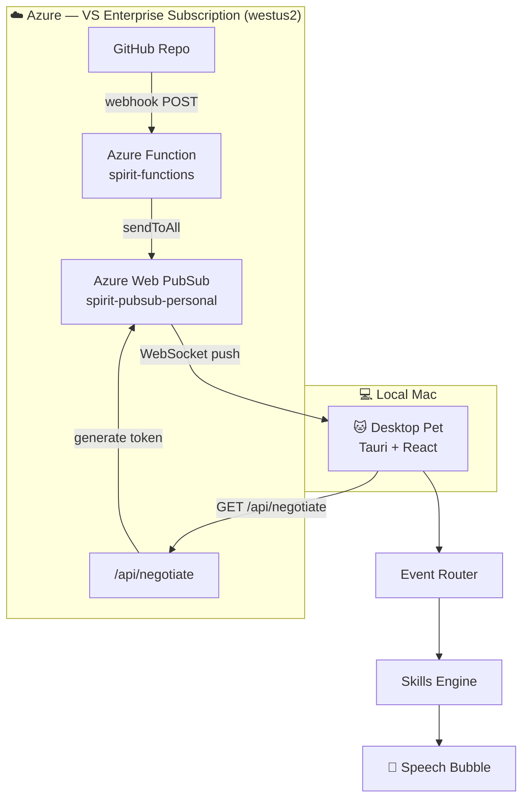

# Abby AI Companion — Desktop Pet

## Architecture



## Azure Resources

| Resource                  | Type             | SKU          | Cost                    |
| ------------------------- | ---------------- | ------------ | ----------------------- |
| `spirit-pubsub-personal`  | Web PubSub       | Free_F1      | $0 (20k msg/day)        |
| `spirit-functions`        | Function App     | Consumption  | $0 (1M exec/month free) |
| `spiritstorage01`         | Storage Account  | Standard_LRS | ~$0.01/month            |
| `WestUS2LinuxDynamicPlan` | App Service Plan | Consumption  | $0                      |

**Subscription:** Visual Studio Enterprise ($150/month credit)
**Resource Group:** `rg-project-spirit` (westus2)
**Tenant:** Personal (`ningchenliang98gmail.onmicrosoft.com`)

## Function Endpoints

| Endpoint                                                        | Method | Purpose                                          |
| --------------------------------------------------------------- | ------ | ------------------------------------------------ |
| `https://spirit-functions.azurewebsites.net/api/negotiate`      | GET    | Returns WebSocket URL with token for desktop pet |
| `https://spirit-functions.azurewebsites.net/api/github-webhook` | POST   | Receives GitHub webhooks → pushes to PubSub      |

## Quick Start

```bash
npm install
npm run tauri dev
```

Desktop pet auto-connects to Web PubSub via `/api/negotiate`.

### Test the full pipeline

```bash
# Send a test notification via PubSub
node scripts/pubsub-send.mjs notification.received '{"title":"PR review request","body":"Lily asked you to review a PR"}'
```

## Event Flow

```text
GitHub webhook → Azure Function → Web PubSub → WebSocket → Desktop Pet → route() → skill → 💬
```

| Event                            | Skill             | Result                  |
| -------------------------------- | ----------------- | ----------------------- |
| `pet.clicked`                    | helloSkill        | "Hi Abby!" 😊           |
| `notification.received` (review) | notificationSkill | "High priority: ..." ⚠️ |
| `notification.received` (other)  | notificationSkill | "📬 {title}" ⚠️         |
| `message.received`               | messageSkill      | "💬 {from}: {text}" 😊  |

## Project Structure

```text
apps/desktop/src/
  App.tsx              — main UI + state
  ContextMenu.tsx      — right-click menu (Sleep/Wake/Quit)
  hooks/useDrag.ts     — window drag logic
  skills.ts            — skill registry
  loadPreferences.ts   — read .project-spirit/preferences.json
  websocket.ts         — WebSocket connection to Web PubSub

packages/core/src/
  router.ts            — event → skill matching
  events.ts            — typed event definitions
  skill.ts             — Skill interface
  preferences.ts       — Preferences type + defaults
  logger.ts            — leveled logger (debug/info/warn/error)

packages/skills/
  helloSkill.ts        — pet.clicked → "Hi Abby!"
  notificationSkill.ts — notification.received → priority detection
  messageSkill.ts      — message.received → "💬 from: text"

functions/
  src/functions/index.mjs — Azure Functions (negotiate + github-webhook)
  host.json
  package.json

scripts/
  negotiate.mjs        — generate WebSocket client URL (dev tool)
  pubsub-send.mjs      — send event via Web PubSub (testing)
  github-poll.mjs      — poll GitHub notifications (dev fallback)
  send-event.mjs       — write event to local inbox (testing)

tests/
  e2e.integration.test.ts — full event→router→skill integration test
```

## Preferences

Config file: `.project-spirit/preferences.json` (project root, gitignored)

```json
{
  "petName": "Abby",
  "defaultMood": "idle",
  "bubbleDurationMs": 2000
}
```

## Dev Tooling

- **Vite** + **React** + **Tauri** — desktop app stack
- **Vitest** — unit + integration tests
- **ESLint** + **Prettier** — code quality
- **Husky** + **lint-staged** — pre-commit: lint + format + test
- **GitHub Actions CI** — lint + format + test on every PR
- **Branch protection** — main requires CI pass

## Compliance Notes

- All Azure resources on personal VS Enterprise subscription (no company data)
- GitHub webhook: only receives metadata from repos you configure
- No Microsoft Graph / Teams integration (requires admin consent)
- Company Teams data stays local if ever integrated

## Releases

- **v0.1.0** — Basic pet: click, drag, transparent window
- **v0.2.0** — Context menu, sleep mode, preferences, event router, logger

## Roadmap

- [x] Azure Function `/api/negotiate` — auto token for desktop pet
- [x] Azure Function `/api/github-webhook` — receive GitHub events
- [ ] Configure GitHub webhook on repos
- [ ] Desktop pet auto-negotiate on startup (replace .env.local)
- [ ] Gmail / personal calendar integration
- [ ] v0.3 release
